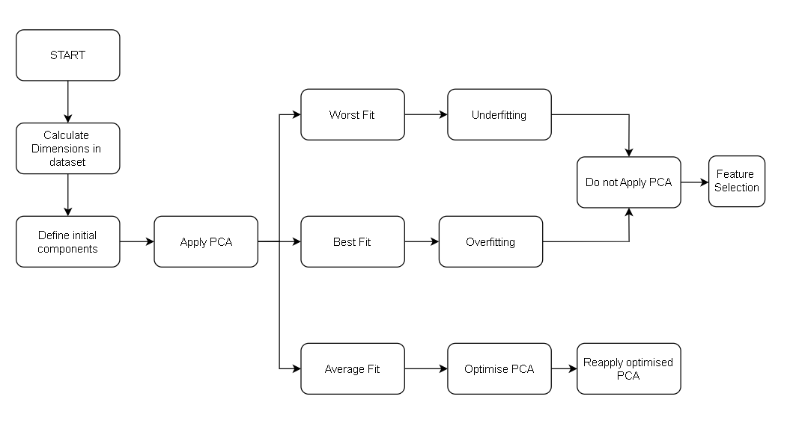
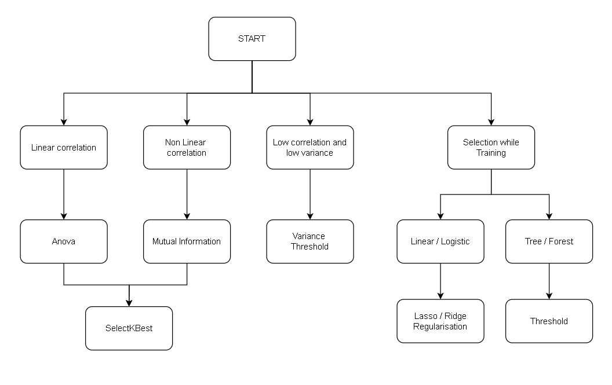

# Architecture doc for Data Reduction

Flow of Program described from START. Also mentions the steps to be executed or the algorithm to follow in each step. 

Step 1: Generic Dimesnionality Reduction & Optimisation

Step 2: Generic Feature Selection & Optimisation

